# Rothult-ESPeasy

**Hacking an IKEA Rothult NFC lock to be remotely controlled by a ESP8266 WiFi module (D1 mini)**

IKEA Rothult is a fairly cheap (~200SEK/€20) smart NFC lock for drawers, cabinets etc, and provides a nice and simple mechanichal base for different type of projects with electrically controlled locks.

This guide shows how to patch it up with an ESP8266 (Wemos D1 mini) to control it remotely over WiFi.

The function of the NFC locking will work in parallel, so you can use that as backup. 
If that's not wanted, then you can disable the NFC function. 
There is actually a good reason to disable NFC when running on mains power, and that is because the onboard controller unlocks the lock on power up. It's therefore possible to pull open the locked compartment for a short moment when power is applied.  

The onboard controller will not recognize when we manipulate the motor, but our code will follow/sync with the onboard controller and also report back when it lock/unlock.

There's another interesting project by 'jetpilot305' (https://github.com/jetpilot305/Rothult-Arduino) that goes in another direction, but also have some useful information worth looking at.
Combining those projects could give a cleaner integration with fewer wires, but would definitely kill the NFC since he doesn't support that in his project.
It's also a bit more complicated due to need of reprogramming the onboard MCU, which requires an ST-link programmer.

I choose to use ESPeasy for the software part, but you can of course write your own Arduino sketch etc if you like. ESPeasy is actually not the best way to realise the motor control due to latency, but it's a very acccessible and versatile platform.

Commands can be sent using e.g. MQTT, HTTP or whatever protocol is supported by ESPeasy. I prefeer MQTT myself, as shown in the pictures below.

**Rothult connections**

This is approx. how the driver circuits on the original PCB look like, and the needed connections are shown to the right. Two 1k (or 1k2 as in the picture) are needed to be put in series with the control signals. If you intend to disable the NFC, then you can skip the extra resistors and instead connect to the opposite side of resistors R12/R13.
Following the colors you can see how the ESP is connected to Rothult.

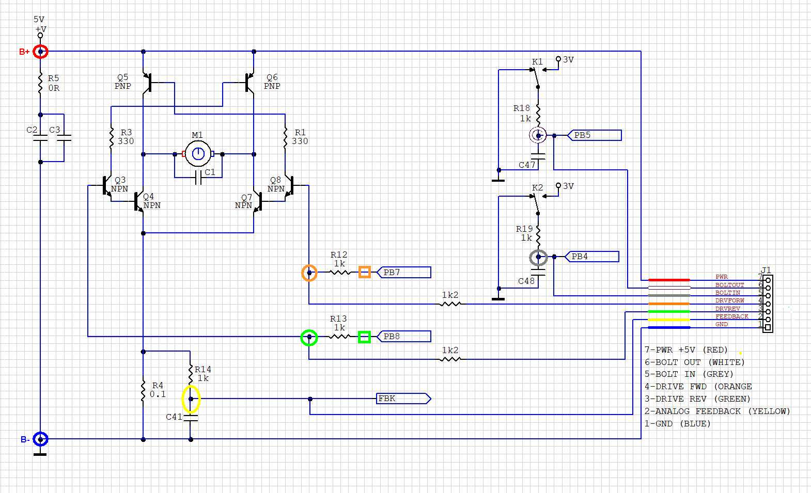

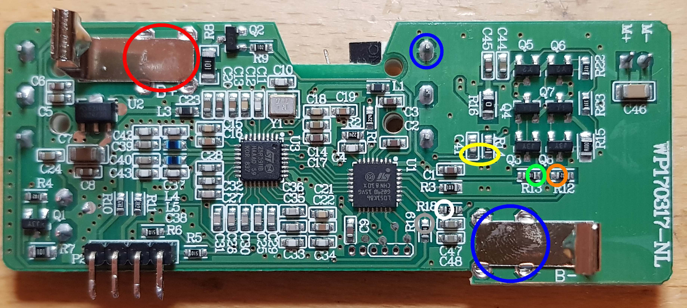

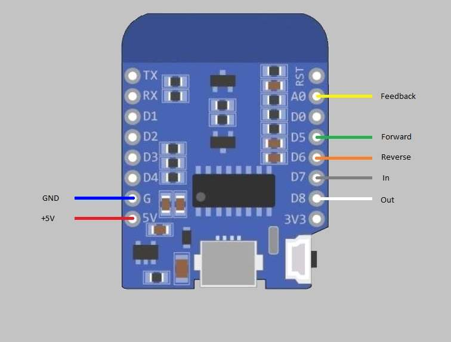

**Disabling NFC**

To disable NFC we can simply put the onboard MCU in permanent reset by shorting the capacitor C2 (magenta marking). 
Solder a thin wire between it's ends, or remove it completely and solder the pads together.

**Final result**

A Wemos D1 mini can be fitted inside the battery compartment (we can't use batteries anyway with an online ESP due to power consumption), 
so drill a hole in the side of the housing (where the battery compartment is inserted) and guide the wires out. Solder them to the D1 with 
some slack, and tuck it into the compartment while sliding it into place.

The screw for the compartment can be removed if you like to simplify the assembly, and the compartment will still stay in place quite firmly, or you can use the screw without the C-clip.

It's a good idea to remove the metal tab connectors between cells in the compartment to avoid short circuits, they can be pulled out with a pair of pliers or be covered with some tape.

To supply power the lock you can e.g. use a cut USB cable and a phone charger. Drill a hole somewere and route the cable in. 
Solder the red and black wires to +5V/GND (or B+/B-) as I've done in the pictures below.  
Remember to fix the cable with e.g. som hot-glue or super-glue.

When reassembling, remember to put back the small roller on the pin that has likely fallen off while flipping the unit around.

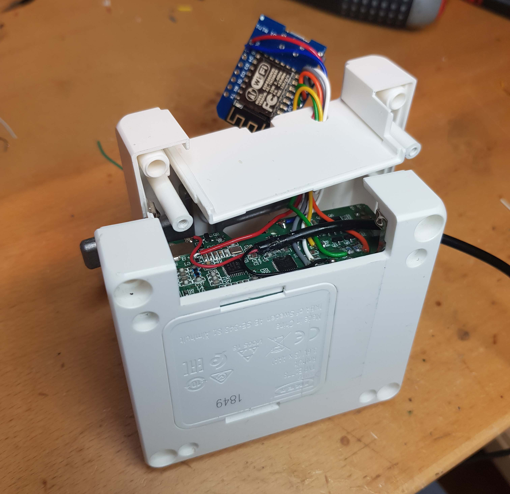

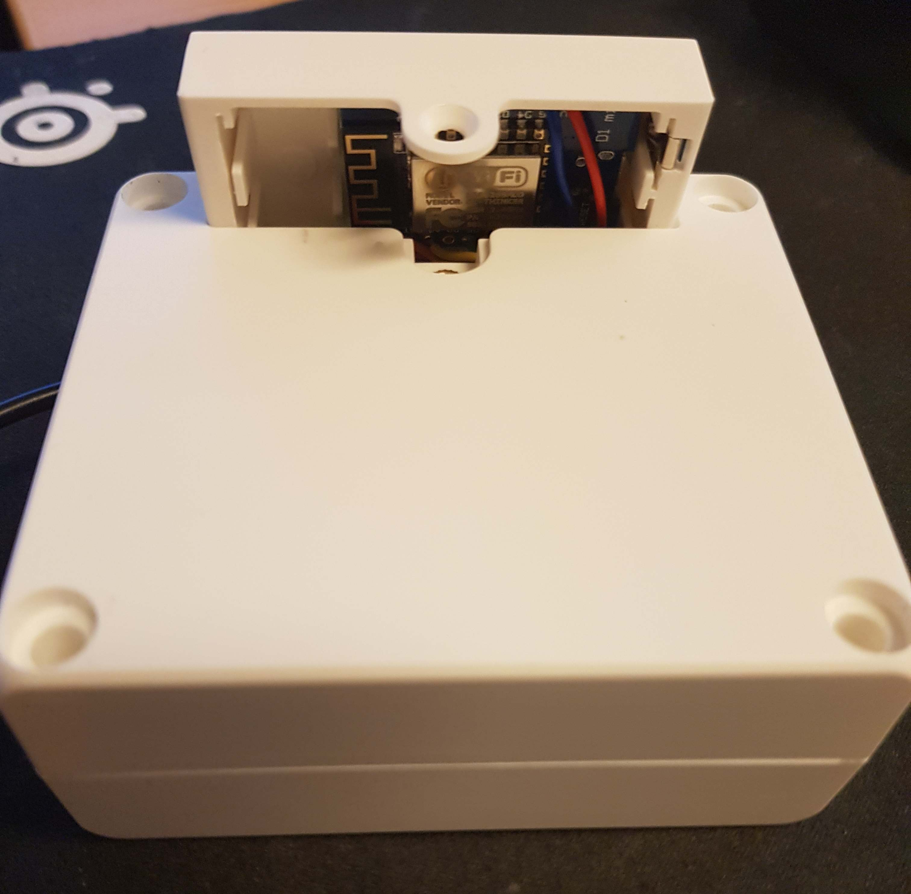

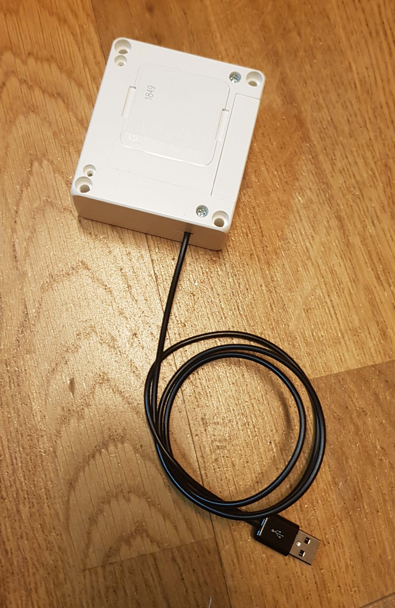

## ESPeasy setup

I'm not covering the basic setup of ESPeasy here and assume that you have flashed the image and established contact before continuing.
My version of ESPeasy when writing this is ESPeasy_mega-20200801 (image file: 'ESP_Easy_mega_20200801_normal_ESP8266_4M1M.bin').

You will also need an MQTT broker set up on your network that you can connect to, and I won't cover that either.

I recommend that you use my settings and topic names etc as much as possible to minimize possible errors during first tests. You can modify to your liking later.
Change only the IP and credentials needed to work with your broker, and name the ESP to 'ESP8266-11-D1'. Be meticulous on spelling names, topics etc exactly correct.

**MQTT controller setup**

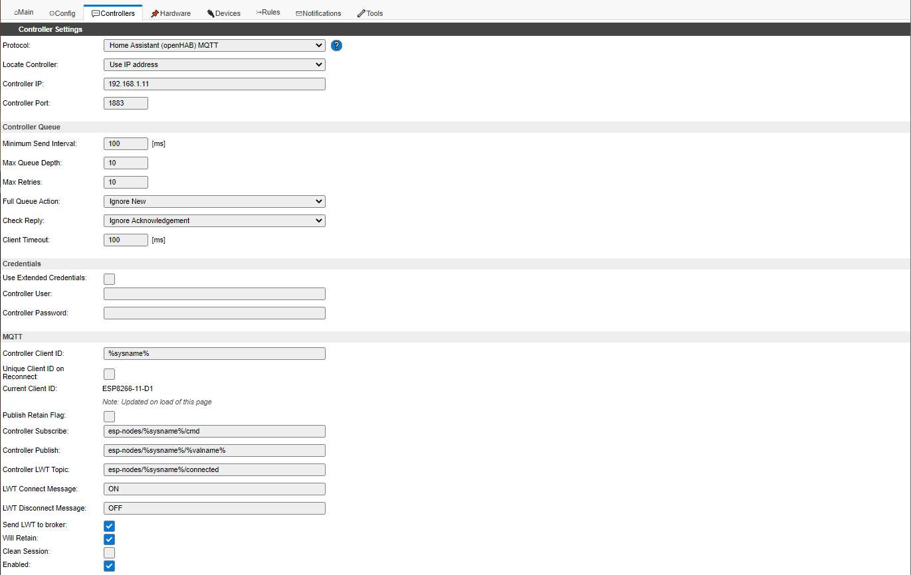

**GPIO setup**

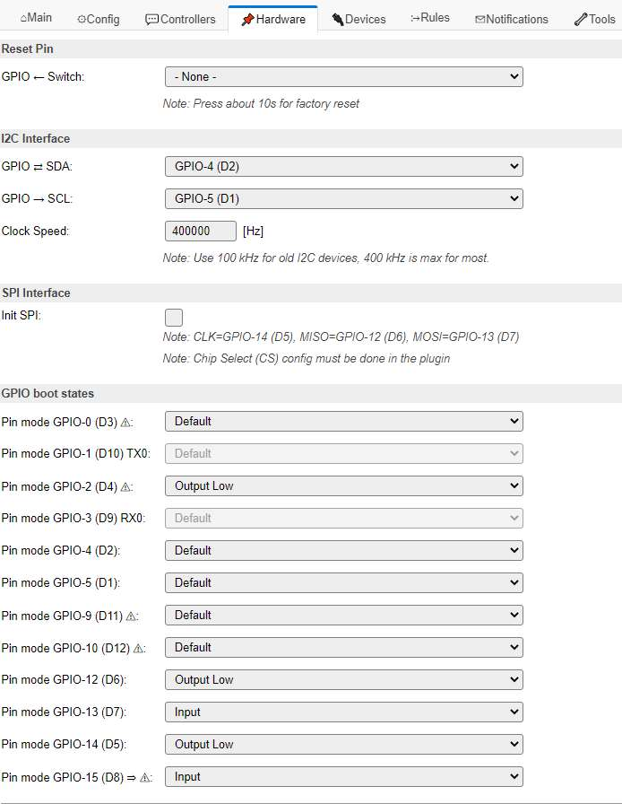

**Enable RULES**

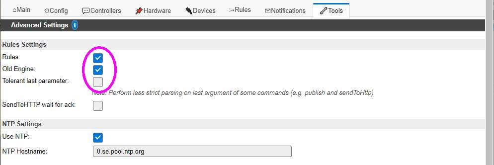

**Paste in the rules from the 'rules.txt' file**

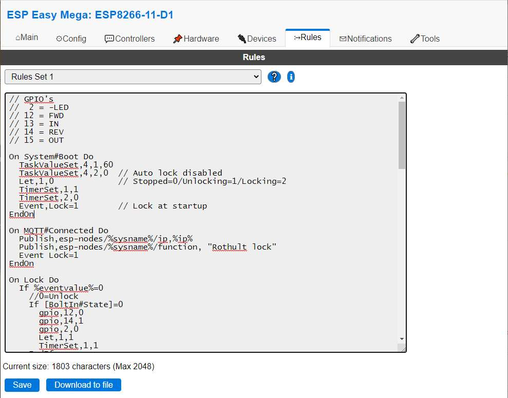

**Configure tasks**

**Overview**

**Add task 1 - BoltIn switch**

**Add task 2 - BoltOut switch**

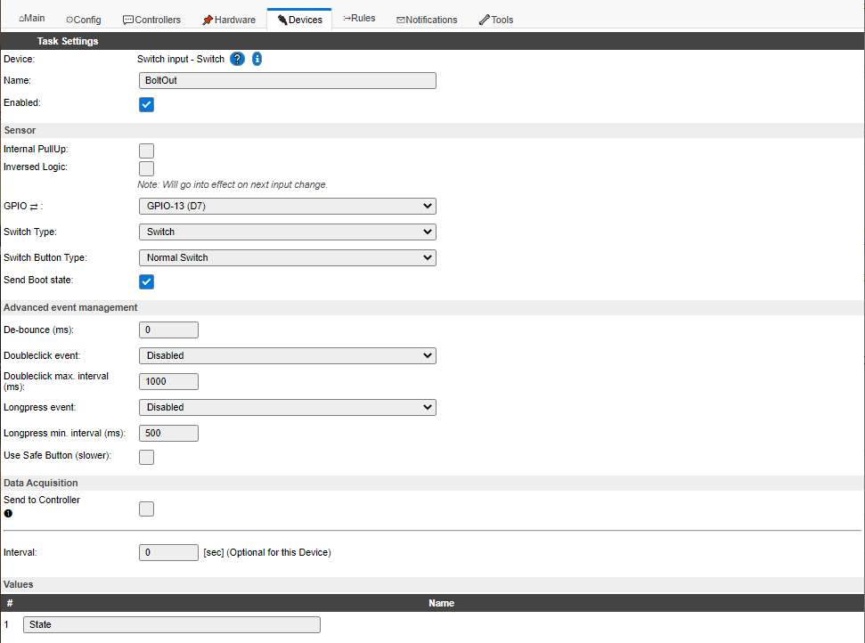

**Add task 3 - Feedback signal (not currently used)**

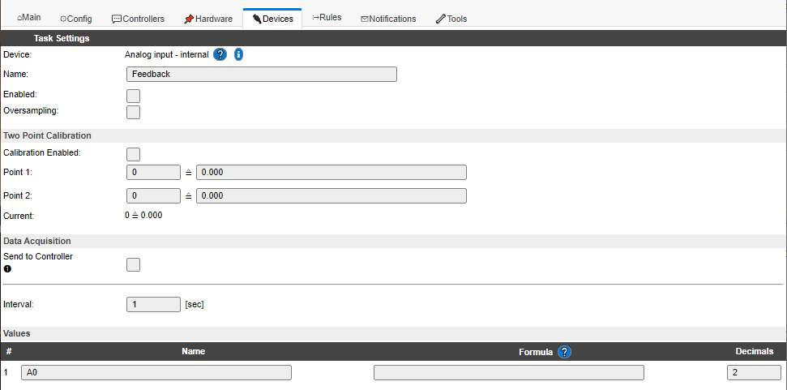

**Add task 4 - Config variables**

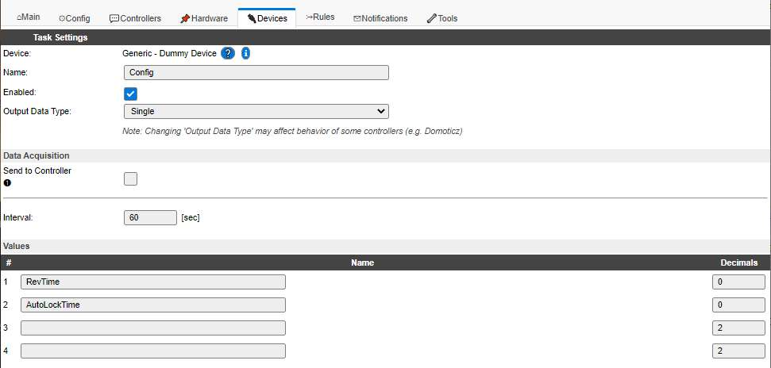

**Add task 11 - WiFi RSSI (optional)**

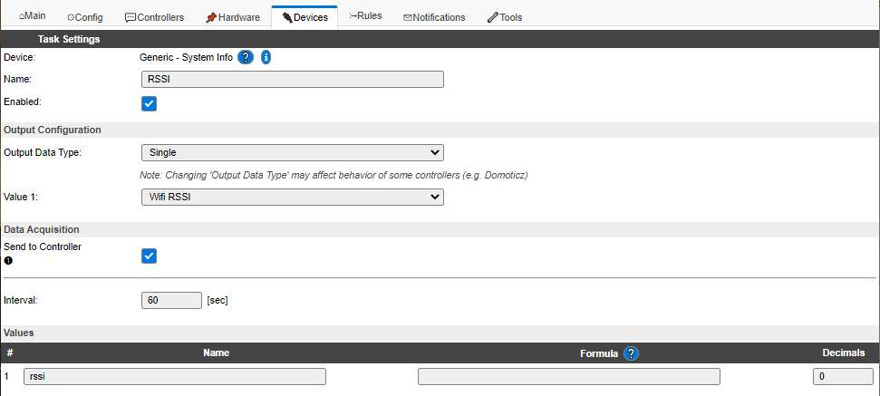

**Add task 12 - Free memory (optional)**

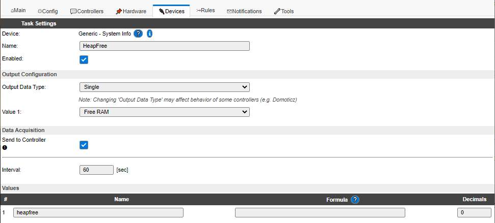

### Test MQTT

If everything works, the lock will drive to the locked position automatically after reboot/power-on. If it's allready in the locked position, nothing should happen.

Time to try some MQTT commands.

A very good tool for debugging MQTT, that can be freely downloaded, is the 'MQTT Explorer' by Thomas Nordquist. 
It's highly recommended!

If everything works, you will see something like this published in MQTT.
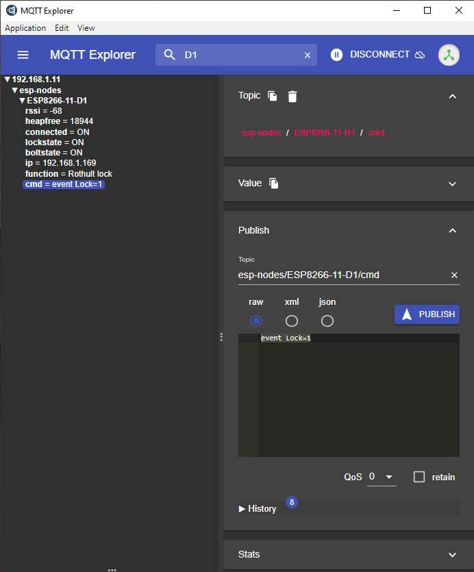

To test the function, type in "esp-nodes/ESP8266-11-D1/cmd" as topic in the 'Publish' form, then select raw and type "event Lock=0" in the payload. Then click PUBLISH.

You should now see 'cmd = event Lock=0' in the explorer tree, and hopefully the lock reacted. If nothing happened, then try changing the '0' to a '1' in the payload and PUBLISH again.

All commands are sent to the #/cmd topic, and "event " must be present in the payload.

Available commands (payloads) are:  
"event Lock=0"   unlock  
"event Lock=1"   lock  
"event Cfg1=xx"  xx sets the number of milliseconds the motor reverses after end detection  
"event Cfg2=yy"  yy sets the number of seconds before automatically locking after unlocking. 0=Auto disabled  
"event Step=0"   run motor forward a short time, debugging  
"event Step=1"   run motor reverse a short time, debugging  

If nothing happened, troubleshoot... 😀

## Future ideas

A word of warning when you start laborating with the rules/code...   
The motor H-bridge doesn't seem to have any protection for driving both directions simultaneously, which could result in letting the magic smoke out of the transistors.
Therefore, ALWAYS be sure to turn off the driver for opposite direction BEFORE activating the intended direction.

On power fail, with NFC enabled, the NFC credentials will be forgotten and the lock will unlock. 
The ESP can also make a slightly uncontrolled startup on power fail/restart and cycle the bolt a whole turn.  
Therefore it could be beneficial with a battery backup.  
A powerbank might be the first thing you think of, but they are generally not useable for this.  
However, a backup should be fairly simple to arrange with only one or two diodes (prefeerable schottky) and a battery pack. 
Three AA cells (alkaline or NiMH) or maybe even a single LiIon (e.g. 18650) should suffice, giving hours of backup time. 
If using NiMH cells, then they can probably be charged in-circuit using a single resistor.  
I haven't tried this yet, but it should work.

Another good idea would be to have wires to the motor (M+/M-) pulled out to some accessible but hidden/unsuspicious place. 
That will make emergency opening possible by momentarily applying 3-5V from e.g. batteries.

On the software side, a better syncronization on reset would be good, or maybe a dedicated Arduino sketch instead of ESPeasy to gain better motor control. 
Maybe write a 'Rothult' plugin for ESPeasy?

Feel free to contribute!

**Happy Hacking!**

